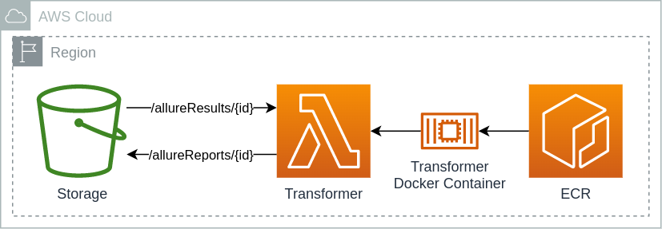

# POC Allure Lambda

This project is a POC to create a lambda function, that can process **Allure Results** stored in **S3**, generate **Allure Report** of it, and finally saves it back to S3.



The approach in short:
1. An S3 bucket is created that
   1. is set up for website hosting
   2. stores allure results in `allureResults` in sub-keys per report
   3. stores allure reports in `allureReports` in sub-keys per report
2. A Docker Lambda function that
   1. is based on Node.js Lambda image, with Java and Python installed, together with AWS CLI and Allure Commandline
   2. expects output as `{"input": "<input prefix>"}`, where the input prefix is either the full key to the result folder or just the sub-key in the `allureResults` folder
   3. copies the results to a temporary folder, converts the results to a report with Allure Commandline, then syncs the temporary report to S3
   4. responds with `{"output": "<output prefix>"}`, with the full output key to the report folder

## Deployment

```shell
cdk deploy
```
